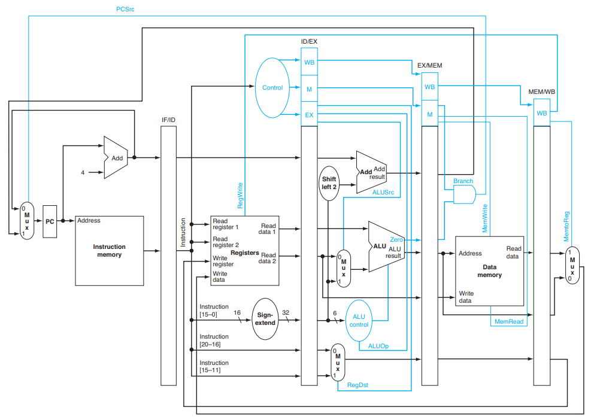
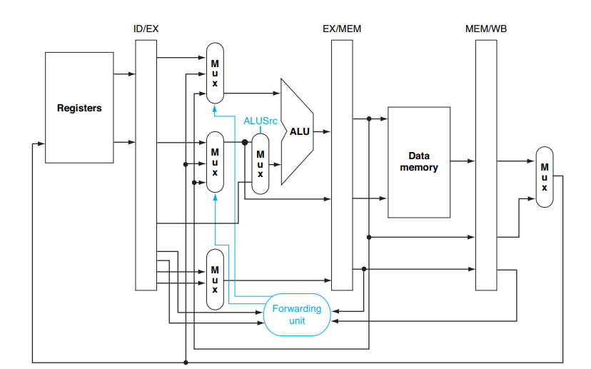
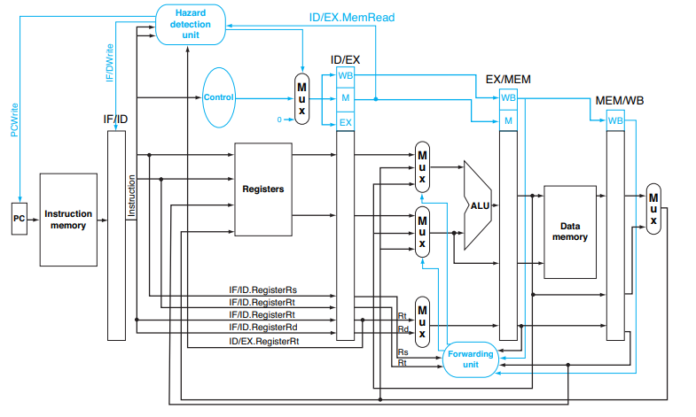
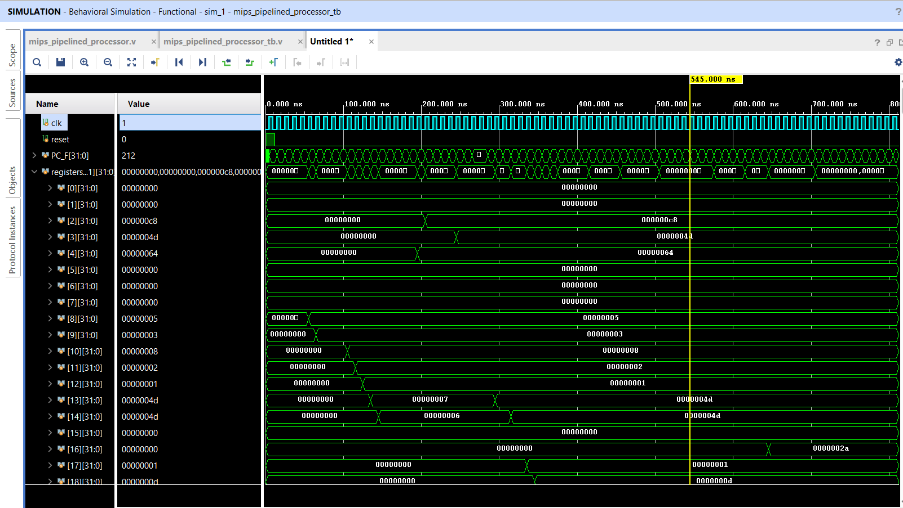
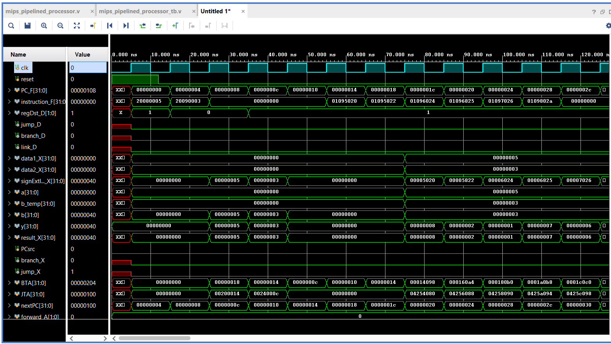

# 32-bit MIPS — Pipelined Processor (RTL Design)

> This is the pipelined implementation of the MIPS processor, built on top of the previous [single-cycle version](https://github.com/bikramghub12345/MIPS_Processor/tree/main). It implements the same MIPS ISA, but in addition it has following typical features of a pipelined processor:


- **5-stage pipeline**: IF → ID → EX → MEM → WB
- **Forwarding unit**: resolves most RAW data hazards with zero stall cycles
- **Hazard Detection Unit (HDU)**: handles the one case forwarding can't — load-use hazards
- **Control hazard handling**: pipeline flush on taken **branches**, **jumps**, and `jr`

---

## Pipeline Overview

```
IF        ID        EX        MEM       WB
──────    ──────    ──────    ──────    ──────
Fetch  →  Decode →  Execute → Memory →  Write
instr     control   ALU       lw/sw     regfile
          signals   result    access    write
          & read
          regfile
                                   
```

Each stage is separated by a pipeline register (`pr_F_D`, `pr_D_X`, `pr_X_M`, `pr_M_W`) that stores all signals needed by downstream stages and transfers them on every rising clock edge. This includes all the `data`, `control signals`, and `PC` values.


A general mips 5 stage pipelined processor(our implementation has some small differences from this diagram). 

*Source: Patterson & Hennessy book.*

---
## Source Files
 
| File | Description |
|---|---|
| `mips_pipelined_processor.v` | Top-level module — connects all stages, implements PC logic, forwarding unit, Hazard Detection Unit, and flush logic |
| `pr_F_D.v` | IF/ID pipeline register — supports `stall` (hold) and `flush` (clear to bubble) |
| `pr_D_X.v` | ID/EX pipeline register — supports `stall` and `flush`|
| `pr_X_M.v` | EX/MEM pipeline register |
| `pr_M_W.v` | MEM/WB pipeline register |
| `alu.v` | 32-bit ALU |
| `alu_control.v` | Generates 4-bit ALU control from `alu_op` + `funct` |
| `control_unit.v` | Decodes instruction, generates all control signals |
| `regfile.v` | 32×32 register file — async read, synchronous write |
| `imemory.v` | Instruction memory — async read |
| `dmemory.v` | Data memory — async read, synchronous write |
| `adder.v` | 32-bit adder with overflow detection |
| `sub.v` | 32-bit subtractor with overflow detection |
 
---

## Supported Instructions

**R-type:** `add`, `addu`, `sub`, `subu`, `and`, `or`, `xor`, `nor`, `slt`, `sltu`, `sll`, `srl`, `sra`

**I-type:** `addi`, `andi`, `ori`, `xori`, `slti`, `sltiu`, `lui`, `lw`, `sw`, `lb`, `lbu`, `lh`, `sb`, `sh`, `beq`, `bne`

**J-type:** `j`, `jal`, `jr`

---

## Control Signals

The control unit decodes `instruction_D` and produces the following signals, which travel through pipeline registers until that stage which needs them:

| Signal | Width | Used in stage | Purpose |
|---|---|---|---|
| `regDst` | 2-bit | EX | Selects write register: rt (I-type), rd (R-type), $31 (jal) |
| `alu_src` | 1-bit | EX | Selects ALU B input: `register` or `sign-extended imm` |
| `alu_op` | 4-bit | EX | Together with `funct` produces `alu_control` |
| `jump` | 1-bit | EX | Unconditional jump (j, jal) |
| `jumpReg` | 1-bit | EX | Jump-to-register (jr) |
| `link` | 1-bit | EX | Write PC+4 into $31 (jal) |
| `branch` | 1-bit | EX | Conditional branch (beq, bne) |
| `memRead` | 1-bit | MEM | Enable data memory read |
| `memWrite` | 1-bit | MEM | Enable data memory write |
| `memSize` | 2-bit | MEM | Access size: 00=byte, 01=half-word, 10=word |
| `memUnsigned` | 1-bit | MEM | Zero-extend (1) vs sign-extend (0) for load instruction |
| `memtoReg` | 1-bit | WB | Write-back source: `memory read data` or `ALU result` |
| `regWrite` | 1-bit | WB | enables register file write |

---

## Hazard Handling

### Data Hazards — Forwarding Unit


*Source: Patterson & Hennessy book.*

When an instruction in EX needs a value still being computed by an older instruction in MEM or WB, the forwarding unit bypasses the register file and provides the value directly to the ALU inputs through direct wiring.

```
forward_A / forward_B:
  2'b00  →  use regfile output (no hazard)
  2'b01  →  forward result_M  (producer in MEM, 1 instruction ahead)
  2'b10  →  forward write_data_regfile (producer in WB, 2 instructions ahead)
```

**Note**: MEM-stage forward has priority over WB-stage when both match because MEM holds the more recent value.

**Store-data forwarded value**: When we want to store the forwarded value, we want the forwarded value to be passed to the data memory through the EX/MEM register's `data2` input, not the raw register-file output. This ensures `sw` correctly stores forwarded values when the source register was written by the immediately preceding instruction. But when there is no forwarding, the forwared value output is just the raw register-file output.

### Data Hazards — Load-Use Stall (HDU)

*Source: Patterson & Hennessy book.*

Forwarding cannot handle a `lw` immediately followed by a dependent instruction — the loaded value doesn't exist anywhere in the pipeline until MEM completes, but the consumer needs it one cycle earlier in EX. So we must stall for one cycle.

Detection (combinational, evaluated every cycle):

```verilog
if (memRead_X && (write_reg_X == reg1_D || write_reg_X == reg2_D) && write_reg_X != 0)
    stall = 1;
```

When `stall = 1`:
- **PC**: on hold
- **IF/ID register**: on hold (same instruction re-presented to Decode next cycle)
- **ID/EX register**: flushed to bubble (all control signals and data zeroed)


### Control Hazards — Branch & Jump Flush

Branches and all jumps are resolved in the **EX stage**. By the time the redirect is known, two instructions have already been fetched on the wrong path (currently in IF and ID). Both have to be flushed by asserting `flush`:

```verilog
flush = PCsrc || jump_X || jumpReg_X;
```

When `flush = 1`:
- **IF/ID register**: cleared to bubble (squashes the instruction in Decode)
- **ID/EX register**: cleared to bubble (squashes the instruction entering Execute)
- **PC**: updated to `nextPC` (BTA, JTA, or `data1_X` for `jr`) 

This results in a **2-cycle branch/jump penalty** — the cost of resolving control flow in EX rather than D stage.

---

## Structural Hazards (Avoided by Design)

Structural hazards occur when two pipeline stages fight for the same hardware resource in the same cycle. This design avoids them by construction:

- **Separate instruction and data memories** — IF and MEM never conflict over memory access
- **Register file with 2 read ports and 1 write port** — Decode (2 reads) and WB (1 write) can proceed simultaneously

---

## Testing and simulation

Verified with a comprehensive testbench (`mips_pipelined_processor_tb.v`) covering 7 groups:

| Group | Tests |
|---|---|
| 1 | Basic R-type and I-type ALU operations (no hazards, nop-padded) |
| 2 | Back-to-back ALU instructions — M→X and W→X forwarding on both operands |
| 3 | `sw` with forwarded store-data, then `lw` immediately followed by dependent `add` (load-use stall) |
| 4 | Immediate ops: `andi`, `ori`, `xori`, `slti`, `lui` |
| 5 | Shift instructions: `sll`, `srl` |
| 6 | `beq` not-taken (no flush), `bne` taken (flush) |
| 7 | `jal` / `jr` subroutine call and return — `$ra` correctly written, control returns to caller, `j` infinite loop |



---

## References

1. *Computer Organization and Design* — Patterson & Hennessy
2. [MIPS Green Sheet](https://www4.comp.polyu.edu.hk/~comp2421/MIPS%20instructions%20cheat%20sheet.pdf)
3. [Single-Cycle MIPS (predecessor project)](https://github.com/bikramghub12345/MIPS_Processor/tree/main)